# py-suruga-13-slackbot-handson

こちらはPython駿河 & Unagi.py合同勉強会で行われるSlackbotハンズオンの資料です。

[Python駿河 勉強会 #13 〜オンラインSlack botハンズオン再び〜 - connpass](https://py-suruga.connpass.com/event/175942/)

[Unagi.py 勉強会29枚目～オンラインSlack botハンズオン再び～ - connpass](https://unagi-py.connpass.com/event/175956/)

## 概要

今回のハンズオンは以下を扱います。

- SlackアプリをSlackに設定する方法
- GitHub Actionsの基本的な扱い
- Herokuへのデプロイ
- SlackbotからWeb APIを操作して結果をbotが答える

時間内に終わらなくても、ドキュメントの内容を進めることで完走できます。

このハンズオン中にPythonの具体的なコードの解説はしない予定です。（ハンズオン後の懇親会やTwitterなどでお聞きください）

Pythonの実行環境は3.7以降を対象にしています。

## あるとよいツールの知識

- Gitの基礎知識: add, commit, push/pull, remoteなどの操作コマンド
- GitHubの基礎知識: 主にClone, GitHubのリポジトリへのpush/pull
- Web API/jsonの扱い、HTTPS経由のAPI操作

## ハンズオンに必要な環境

### 対象OS

- Windows 10
- （Mac, Linuxは動作しますが、詳しくサポートはしません）

### PCにインストールするもの

- Python 3.7: 公式版をおすすめします。
- エディター,IDE:基本的にお好きな物で
  - Visual Studio Code: 講師が利用します
  - PyCharm
  - Visual Studio: Python拡張をおすすめします -> [Visual Studio を使用した Python 開発 - Visual Studio | Microsoft Docs](https://docs.microsoft.com/ja-jp/visualstudio/python/?view=vs-2019&fbclid=IwAR0U_6oJEYM8mJB-LcE7XAP6DNobZzlXpvPLNXoev2XiwJQi9gwy0JL0X_w)
  - etc...
- ターミナル
  - Win:コマンドプロンプト（cmd.exe）
  - （Mac, Linuxはお好きなターミナルアプリで）
  - エディター, IDE内蔵のターミナルでも作業できます
- Git: なるべく最新
- Heroku Cli
  - [The Heroku CLI | Heroku Dev Center](https://devcenter.heroku.com/articles/heroku-cli#download-and-install)

## システムの全体図

全体図が乗ります（イメージ全体図を作成中）

## ハンズオン手順

### あらかじめ準備したほうが良いもの

利用する各サービスの登録、 ログインをします

- GitHub
  - [登録](https://github.com/join)
  - [ログイン](https://github.com/login)
- Heroku
  - [登録](https://signup.heroku.com/jp)
  - [ログイン](https://id.heroku.com/login)
- Slack
  - [新規ワークスペース作成](https://slack.com/get-started#/create)

Slackbotを作る際には、開発用のSlackワークスペースを各自で用意することをおすすめします。（Slack側でもアナウンスされています）

サービスの登録については各サービスの案内にしたがってください。

### 作業ディレクトリ

基本的にお好きな場所で構いません。わかりやすい位置としてホームフォルダのドキュメントを基準に操作します。

```cmd
cd ~\Documents
```

### ハンズオンのリポジトリをフォークしてClone

このハンズオンのGitHubリポジトリを、参加者のGitHubのアカウントへフォークします。そのフォークしたリポジトリをローカル環境にCloneします。

GitHubのフォーク方法はヘルプを確認します。

[リポジトリをフォークする - GitHub ヘルプ](https://help.github.com/ja/github/getting-started-with-github/fork-a-repo)

フォーク後はローカル環境にcloneします。コマンドでの操作はこちらです。

```cmd
git clone https://github.com/[各参加者のgithubアカウント名]/py-suruga-13-slackbot-handson.git
```

エディター、IDEからのgit cloneはそれぞれのアプリの利用方法を参照してください。

### ローカル開発環境の用意

Pythonはシステムにインストールされた実行環境以外の仮想環境を用意できます。仮想環境を作ることでシステム側の環境を汚すこと無く開発環境の構築ができます。

仮想環境は以下のコマンドで作成します

```cmd
cd py-suruga-13-slackbot-handson
python -m venv .venv
```

仮想環境を利用するときには、以下のコマンドを実行します

```cmd
.\.venv\Scripts\activate.bat
rem 仮想環境上に必要なパッケージをインストールします
(.venv) > pip install -r requirements.txt
```

Pipenvでの環境作成もできます。このハンズオンでは利用しませんが、普段利用されている方はPipfileも同梱しているのでご利用ください。

仮想環境を終了する場合は以下のコマンドを実行します。

```cmd
(.venv)deactivate
```

### Slackアプリ, Herokuアプリで利用する名前を生成する

今回のハンズオンでは、SlackアプリとHerokuアプリで利用する名前を同一にします。その名前の生成は、リポジトリ内にある `gen_appname.py` を実行して生成します。

```cmd
>python gen_appname.py
Generate Slack/Heroku App name: 'pysurugabot-[ランダムな数字6桁]'
```

生成したアプリ名を控えてください。（`appname.txt`というファイルも生成されるようにしています）

### Slackアプリの作成と設定

まず初めにBotとなるSlackアプリをSlack上で作成します。

「Create a Slack App」からApp Nameにアプリ名を入力します。（このアプリ名はHerokuのアプリ名でも利用します。


Slack WorkSpaceはハンズオン用に新たに取得したワークスペースを利用してください。

アプリが作成できたら、「OAuth & Permissions」の「Scopes」>「Bot Token Scopes」にスコープの設定を行います。


「Bot Token Scope」はBotとなるSlackアプリがSlackワークスペースに利用できる権限の範囲（スコープ）です。

この時点では`chat:write`のみで、botがSlackへメッセージを送るためのスコープのみを設定していますが、後ほどの設定で、いくつか追加されます。


追加したら、ページの上にある「Install App to Workspace」をクリックし、SlackアプリをSlackワークスペースへ追加します。


追加が終わると、「Bot User OAuth Access Token」が表示されます。このトークンをまず控えてください。


次に、右上の「Basic Information」へ戻り、「App Credentials」の中にある「Signing Secret」を控えます。


### Herokuのアプリを作成する

Herokuのアプリを作成して必要な設定を行います。

まずHerokuのdashboardへアクセスして「New」>「Create New app」を選択します。

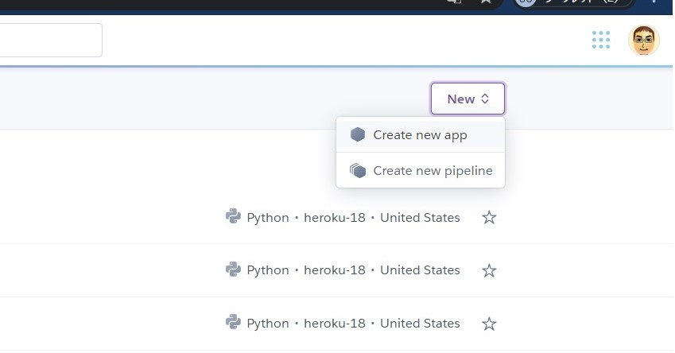

App nameへSlackアプリのアプリ名を入れます。このアプリ名はHerokuアプリの外部アドレスに利用されるので、Heroku内でアプリ名が被る場合に利用できないと出ます。

（今回のハンズオンではあらかじめ被らないようなアプリ名を生成してされているはずです）

そのまま「Create App」を押してHerokuのアプリを作成します。

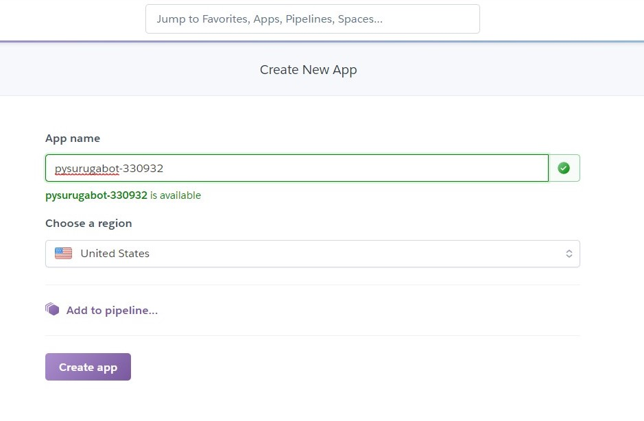

作成されると、Herokuアプリ名のメニューに入ります。

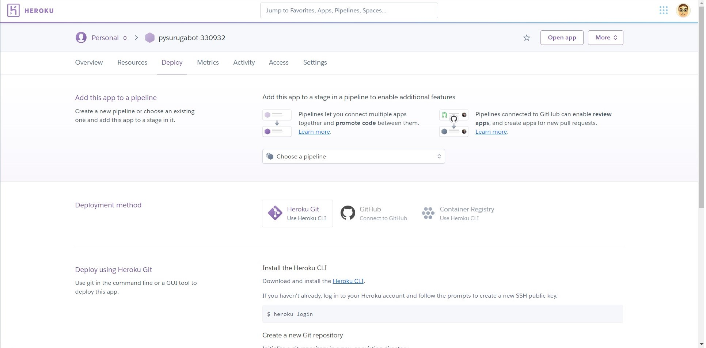

### Herokuの環境変数にSlackbotで利用するシークレットを登録

Slackbotが実際に動作する環境がHerokuになります。そのため、Herokuの実行環境にSlackbotがSlackと通信する際に利用するapiのトークンやシークレットを覚えさせる必要があります。

Herokuのアプリメニューにある「Settings」の「Config Vars」へ以下の2つを登録します。

|KEY|VALUE|
|---|---|
|SLACK_BOT_TOKEN|Slackアプリ設定で控えた「Bot User OAuth Access Token」|
|SLACK_SIGNING_SECRET|Slackアプリ設定で控えた「Signing Secret」|

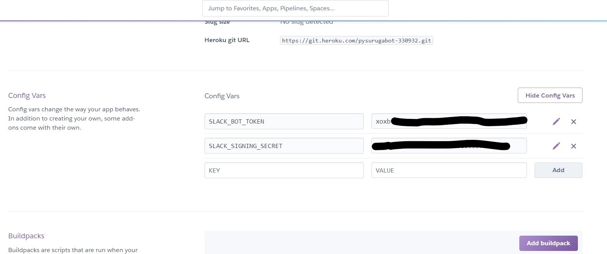

### Herokuの認証情報を取得する

Heroku Cli（herokuコマンド）で連携時に必要な認証情報を取得します。

ローカル開発環境でherokuのログインを行います。

```cmd
heroku login

rem ブラウザでログインするときにエンターを押してください

heroku: Press any key to open up the browser to login or q to exit:
Opening browser to https://cli-auth.heroku.com/auth/cli/browser/******[専用のトークン文字列が出ます]
Logging in... done
Logged in as hrs.sano645@gmail.com

```

ログイン後、HerokuのAPI Keyを表示して控えてください。

```cmd
heroku auth:token

 »   Warning: token will expire **/**/****
 »   Use heroku authorizations:create to generate a long-term token
[api keyが表示されます]
```

注意:このAPI Keyは外部に漏らさないように注意してください。Herokuへの全権限を持った認証キーとなります。

### GitHub ActionsでHerokuへデプロイ

GitHub ActionsはCI/CDと呼ばれている、継続的なアプリのデプロイを行うサービスです。

[Actions | GitHub](https://github.co.jp/features/actions)

GitHubのリポジトリでは基本的に利用できます。定義ファイルとなる `.github/workflows/*.yml`を用意することで、GitHubのリポジトリにPush, PRなどを行うことで自動的にデプロイをします。`*.yml`ファイルはワークフローと呼ばれています。

今回は、GitHubへ変更のpushを行ったときに自動的にHerokuへデプロイを行う設定を用意しています。

[Herokuへのデプロイを行う workflow.yml](.github/workflows/workflow.yml)

このワークフローは変数を設定しています。HerokuのAPI Key、Herokuのアプリ名、Herokuでログインするときのメールアドレスの3つを設定します。

フォークしたハンズオンのプロジェクトページから「Settings」ページへ進み、「Secrets」のページへ進みます。

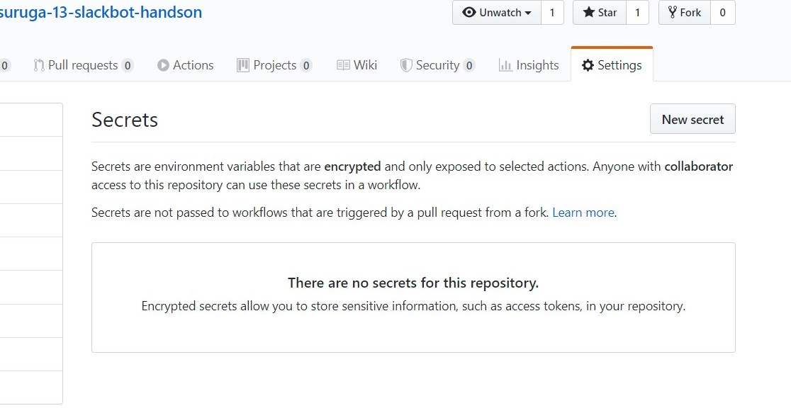

「New secret」ボタンから変数を追加します。

|変数名|値|
|---|---|
|HEROKU_API_KEY|[`heroku auth:token` で取得したトークン]|
|HEROKU_APP_NAME|[Herokuのアプリ名]|
|HEROKU_EMAIL|[Herokuのログインで利用するメールアドレス]|

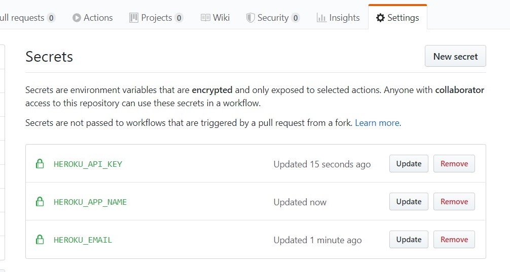

Actionsを動作させます。今回のワークフローでは、GitHubへ変更をpushしたタイミングで自動的にワークフローが動作します。なので何かしらのファイルを追加してcommitします。

ローカル開発環境でファイルを追加します。

```cmd
rem 新しいファイルを追加する。適当な名前のテキストファイルでも、REDAME.mdに変更を入れるで問題ないです。

rem add, commitする
git add .
git commit -m "add new file"

rem pushする
git push origin master
```

pushが終わるとGitHub ActionsとHeroku側でそれぞれデプロイ作業が始まります。

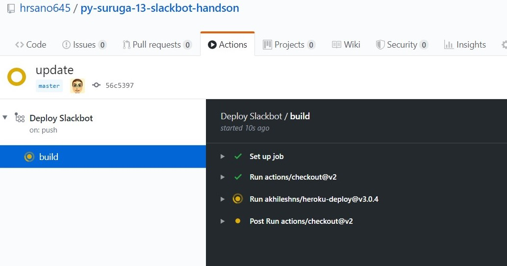
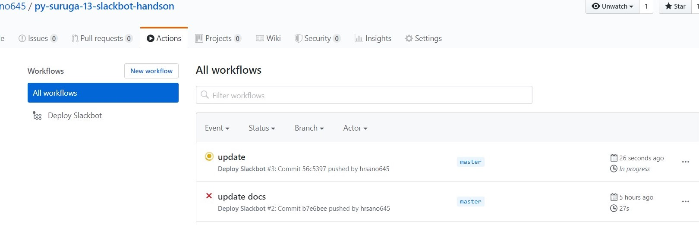

終了したときのGitHubとHerokuの結果はこのように表示されます。


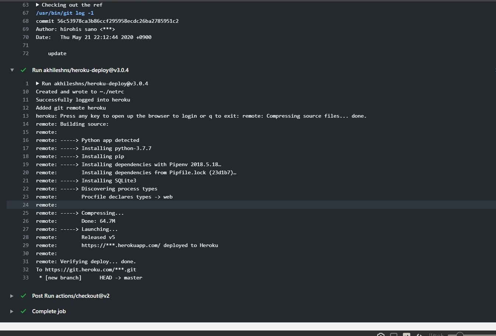

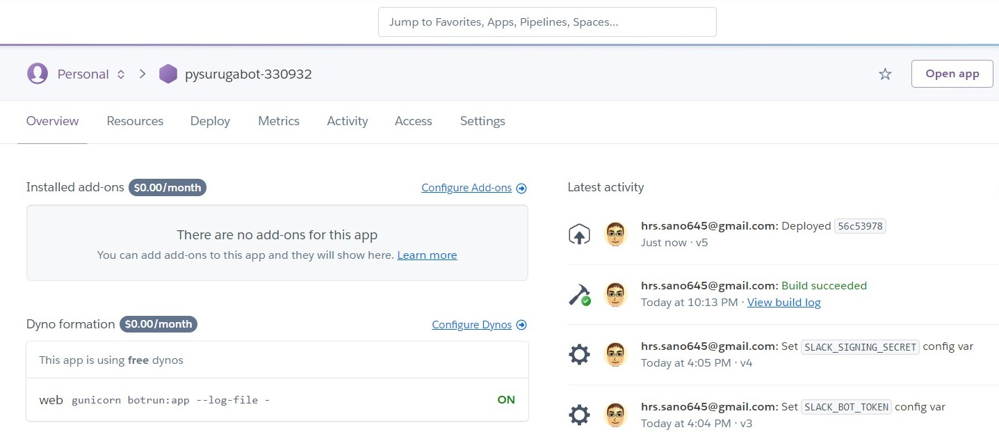

### Slackbotが利用できるイベントを登録する

Slack Event APIを使い、Slackワークスペース上に起きたイベントを、Slackbotが動作するサーバー(ここではHeroku)へ伝えることができます。

ここで2つの設定を行います。

1. Slack Event APIが起きたイベントをサーバーに伝えるためのエンドポイントURL
2. イベントの種類

まず1つめの、Slack Event APIが起きたイベントをサーバーに伝えるためのエンドポイントURLを設定します。

「Event Subscriptions」ページの「Enable Events」にある、右上のボタンをOnにします。

次に「Request URL」にエンドポイントURLを設定します。Herokuのアプリ上でbotアプリが待機しているアドレスを入力します。


> https://[Herokuのアプリ名].herokuapp.com/slack/events

2つ目の、イベントの種類を登録します。

イベントには種類があり、あらかじめアプリで取得したいイベントの種類を登録する必要があります。

Slackアプリのスコープを扱ったときに、イベントによるスコープの決定もあると書きましたが、このイベントを登録することでスコープの変化もあります。

「Event Subscriptions」の「Subscribe to bot events」内に`message.channels`イベントを登録します。


登録後はSlackワークスペースへアプリの再インストールを指示されるので行います。


再インストール時の認証画面を見ると、権限が追加されていることがわかります。先ほどはチャンネルにメッセージを送信するだけでしたが、それに加えてチャンネル内のメッセージを見ることができます。


デプロイとSlackアプリの権限の設定が終わると、Slackbotが利用できます。最後にSlackワークスペース上でbotを呼び出してみます。

最初に、チャンネルにbotユーザーを追加します。


次に、botが反応するワードをポストします。ポストして数秒で返答されるようになっています。


#### 実装されているbotの種類

|botのコマンド|返答|
|---|---|
|hi|英語風の挨拶を返します|
|こんにちは|日本語の挨拶を返します|
|shizuokatenki [西部/中部/東部/伊豆]| 静岡の4地域の天気を教えてくれます|

## ハンズオンのSlackbot概要

今回のハンズオンのシステム全体の様子はこのような形になります。

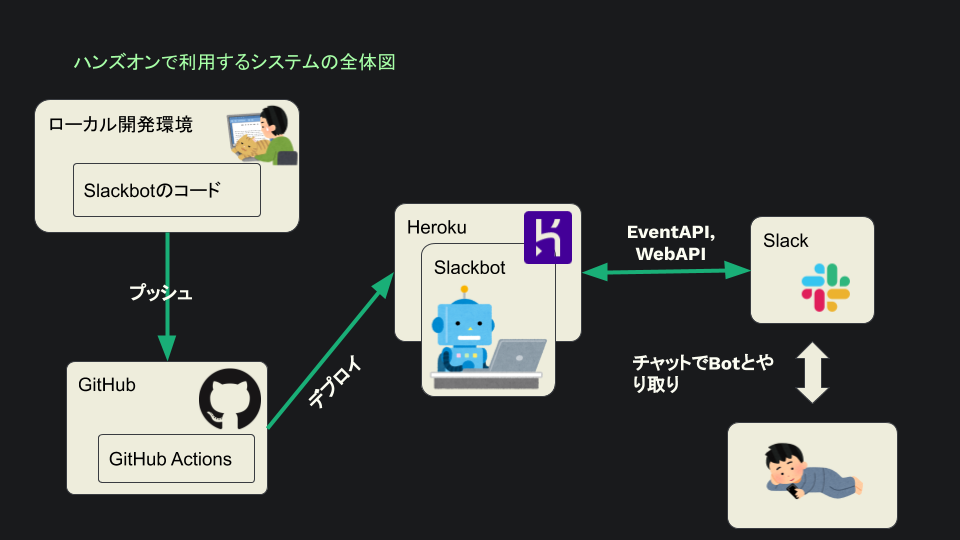

## 参考資料

- [slackapi/python-slack-events-api: Slack Events API adapter for Python](https://github.com/slackapi/python-slack-events-api)
- [slackapi/python-slackclient: Slack Developer Kit for Python](https://github.com/slackapi/python-slackclient)
- [heroku/python-getting-started: Getting Started with Python on Heroku.](https://github.com/heroku/python-getting-started)
- [【Python＋heroku】Python入れてない状態からherokuで何か表示するまで（前編） - Qiita](https://qiita.com/it_ks/items/afd1bdb792d41d0e1145#%E3%83%87%E3%83%97%E3%83%AD%E3%82%A4)
- [API Events | Slack](https://api.slack.com/events)
- [Deploy to Heroku · Actions · GitHub Marketplace](https://github.com/marketplace/actions/deploy-to-heroku)
- [お天気Webサービス仕様 - Weather Hacks - livedoor 天気情報](http://weather.livedoor.com/weather_hacks/webservice)

## おまけ

### ローカル開発環境からHerokuへデプロイする

GitHub Actionsを使ってのデプロイではなく、ローカル環境からHerokuへデプロイする手段を紹介します。

`heroku login`を行った後に、herokuへのデプロイ用のgitリポジトリの登録、pushを行います。

```cmd
rem クローンしたリポジトリ内で操作します
rem herokuのアプリ名:今回はpysurugabot-[ランダム数字6桁]

heroku git:remote -a [herokuのアプリ名]
git push heroku master
```